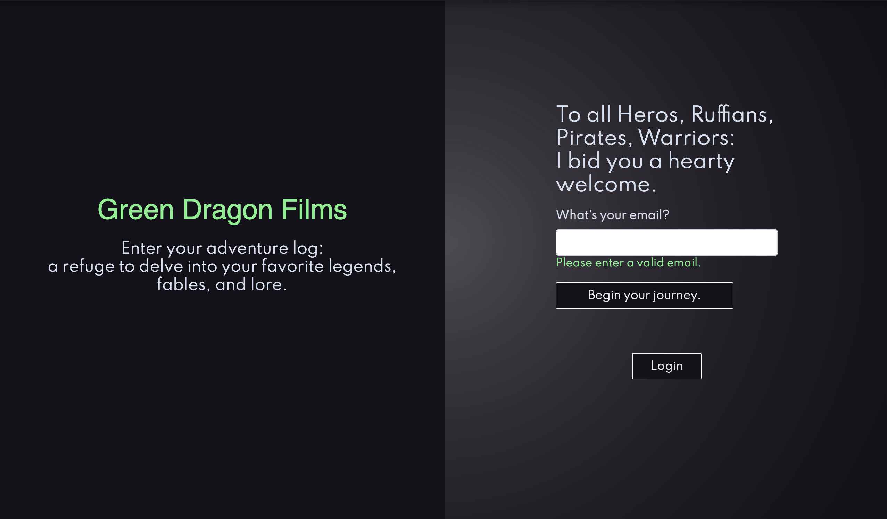
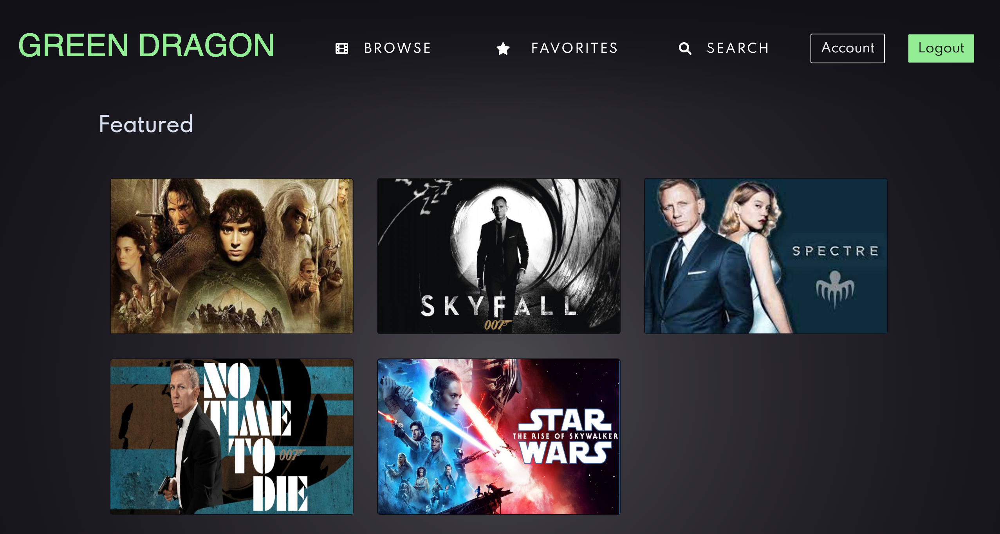
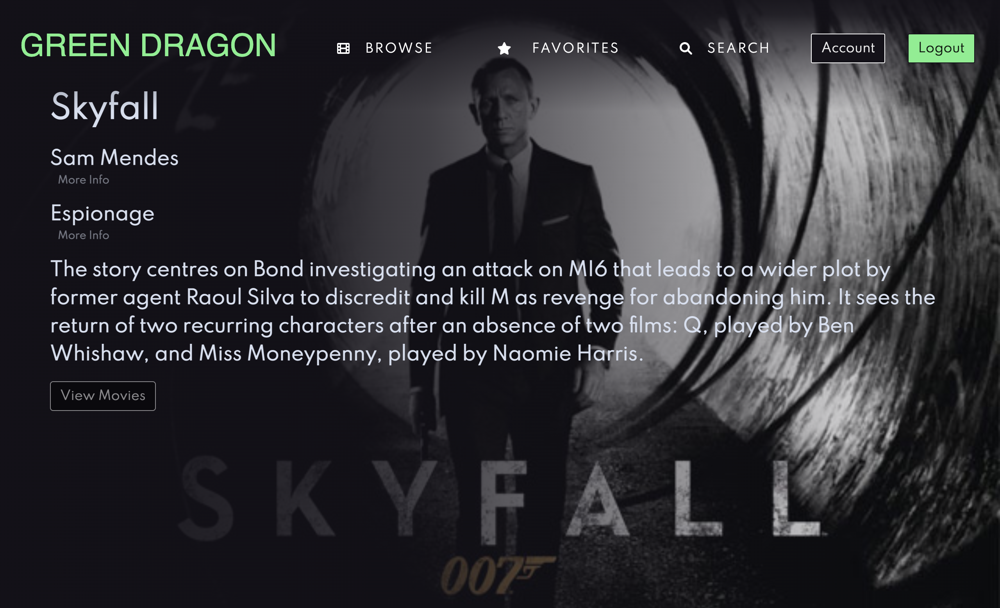

# Green Dragon Films Movie App - React
### Last Updated: May 18, 2022


<p left="float">
    
    
</p>

## Overview
Green Dragon Films is a frontend React application that interacts with a RESTful Movie API to allow users to store and view data about their favorite movies. The theme is action and adventure, so it focuses on sub-genres within the category (no rom-coms here). This app allows users a fun and interactive site to "geek out" about their favorite action and adventure movies. 


## Objective
To build a React frontend application that integrates data from an API to allow users to like their favorite movies. Users can access to information about different movies, directors, and genres. Users will also be able to sign up, update their personal information, and create a list of their favorite movies.

## Key Features
* Login and registration page that allows users to keep a personal account.
* Home page that allows users to view all movies based on genre or featured films.
* Search page that allows users to search movies by movie title.
* Favorites page that allows users to view the movies they've liked.
* The ability to add movies to a list of favorites.
* Account page that allows users to update their personal information.
* Specific movie, genre, and director pages that allow users to view more information about each.
* Redux that manages the movies and user state.


# Approach

### Server-Side
My RESTful Movies API uses MongoDB to store information about movies and users. The API is a RESTful API that stores data using JSON format. You can view the documentation [here](https://greendragonflix.herokuapp.com/documentation.html).

### Client Side
The client side is built using React.js and Redux to manage the users and movies states. 

## Getting Started

You can also view this project on [https://greendragonfilms.netlify.app/](https://greendragonfilms.netlify.app/).

Clone this repository

```git clone https://github.com/krishokr/greenDragonFilms.git```

Go to project's root directory

```cd greenDragonFilms/green-dragon-films```

Install dependencies

```npm install```


Run the project using npm

```npm start```


### Credits Lead Developer and Designer: Kristofer Hokr
 

### Dependencies
- React v17.0.2 or higher
- Axios v0.25.0
- Redux v4.1.2
- React Router Dom v6.2.1
- React Bootstrap v2.1.1